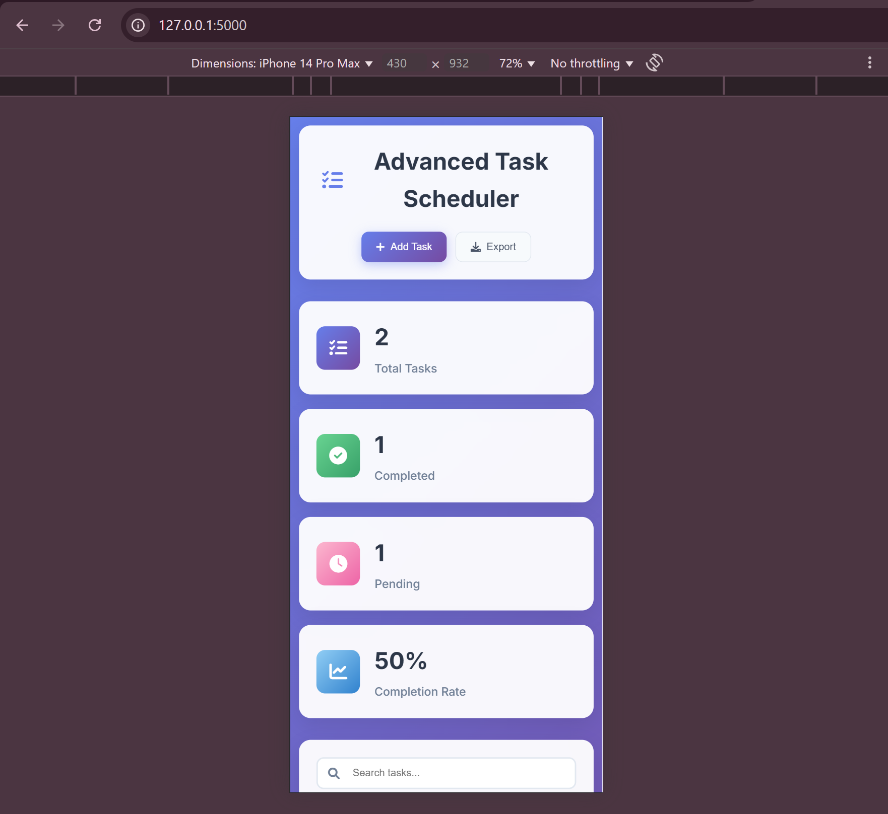

# Advanced Task Scheduler 📝


A modern, full-stack web application for task management with cloud storage integration, built with Flask and AWS S3. This project demonstrates proficiency in full-stack development, cloud services, responsive design, and modern web technologies.

## 🚀 Live Demo

🚧 Deployment in progress...

## 🖼️ Screenshots

### 📋 Dashboard

*Modern dashboard with real-time statistics and progress tracking*

### ✅ Task Management

*Interactive task cards with priority levels and drag & drop functionality*

### 📱 Mobile View

*Fully responsive design optimized for mobile devices*

## ✨ Key Features

### 📊 **Interactive Dashboard**
- Real-time statistics and progress tracking
- Completion rate visualization
- Task categorization and priority management

### 🎯 **Advanced Task Management**
- Create, edit, delete, and complete tasks
- Priority levels (High, Medium, Low) with visual indicators
- Task categories (Work, Personal, Study, General)
- Due date tracking with overdue alerts
- Tag system for better organization
- File attachments with AWS S3 integration

### 🔍 **Smart Filtering & Search**
- Real-time search functionality
- Filter by status, priority, and category
- Responsive and intuitive interface

### 📱 **Modern UI/UX**
- Responsive design for all devices
- Drag & drop file uploads
- Modal-based interactions
- Toast notifications for user feedback
- Smooth animations and transitions
- Modern gradient design with glassmorphism effects

### ☁️ **Cloud Integration**
- AWS S3 for secure file storage
- SQLite database for task persistence
- RESTful API architecture

### 📤 **Data Export**
- Export tasks to CSV format
- Comprehensive task reporting

## 🛠 Technology Stack

### Backend
- **Python 3.8+**
- **Flask** - Web framework
- **SQLite** - Database
- **AWS SDK (boto3)** - Cloud storage integration

### Frontend
- **HTML5/CSS3** - Structure and styling
- **JavaScript (ES6+)** - Interactive functionality
- **Font Awesome** - Icons
- **Google Fonts** - Typography

### Cloud Services
- **AWS S3** - File storage and management

### Development Tools
- **Git** - Version control
- **VS Code** - Development environment
- **Python virtual environment** - Dependency management

## 🚀 Installation & Setup

### Prerequisites
- Python 3.8 or higher
- AWS Account with S3 access
- Git

### 1. Clone the Repository
```bash
git clone https://github.com/Taranjot13/advanced-task-scheduler.git
cd task-scheduler
```

### 2. Create Virtual Environment
```bash
python -m venv task_scheduler_env
# Windows
task_scheduler_env\Scripts\activate
# macOS/Linux
source task_scheduler_env/bin/activate
```

### 3. Install Dependencies
```bash
pip install -r requirements.txt
```

### 4. Environment Configuration
Create a `.env` file in the root directory:
```env
AWS_ACCESS_KEY=your_aws_access_key
AWS_SECRET_KEY=your_aws_secret_key
S3_BUCKET_NAME=your_s3_bucket_name
SECRET_KEY=your_flask_secret_key
```

### 5. AWS S3 Setup
1. Create an S3 bucket in your AWS console
2. Configure bucket permissions for public read access (for file downloads)
3. Create IAM user with S3 access permissions
4. Add credentials to `.env` file

### 6. Run the Application
```bash
python app.py
```

Visit `http://localhost:5000` to access the application.

## 📁 Project Structure

```
task-scheduler/
│
├── app.py                 # Main Flask application
├── requirements.txt       # Python dependencies
├── README.md             # Project documentation
├── .env                  # Environment variables (not in repo)
├── tasks.db              # SQLite database (auto-generated)
│
├── static/
│   ├── style.css         # Modern CSS with animations
│   └── script.js         # Interactive JavaScript functionality
│
├── templates/
│   └── index.html        # Modern HTML template
│
└── screenshots/          # Application screenshots
    ├── dashboard.png
    ├── task-management.png
    └── mobile.png
```

## 🎨 Design Features

### Color Scheme
- Primary: Gradient blues and purples (#667eea to #764ba2)
- Success: Green variants (#38a169, #68d391)
- Warning: Orange variants (#ed8936)
- Error: Red variants (#e53e3e)

### UI Components
- **Glassmorphism cards** with backdrop blur
- **Smooth hover animations** and transitions
- **Responsive grid layouts**
- **Modern form inputs** with focus states
- **Interactive buttons** with 3D effects

## 🔧 API Endpoints

| Method | Endpoint | Description |
|--------|----------|-------------|
| GET | `/` | Main dashboard |
| GET | `/api/tasks` | Get all tasks with filters |
| POST | `/api/tasks` | Create new task |
| PUT | `/api/tasks/<id>` | Update existing task |
| DELETE | `/api/tasks/<id>` | Delete task |
| GET | `/api/stats` | Get dashboard statistics |
| GET | `/export` | Export tasks to CSV |

## 📊 Database Schema

### Tasks Table
```sql
CREATE TABLE tasks (
    id TEXT PRIMARY KEY,
    title TEXT NOT NULL,
    description TEXT,
    priority TEXT DEFAULT 'medium',
    category TEXT DEFAULT 'general',
    due_date TEXT,
    completed BOOLEAN DEFAULT 0,
    created_at TEXT,
    file_url TEXT,
    tags TEXT
);
```

## 🚀 Deployment Options

### Heroku Deployment
1. Create `Procfile`:
```
web: python app.py
```

2. Deploy to Heroku:
```bash
heroku create your-app-name
git push heroku main
```

### AWS Elastic Beanstalk
1. Install EB CLI
2. Initialize and deploy:
```bash
eb init
eb create
eb deploy
```

### Docker Deployment
```dockerfile
FROM python:3.9-slim
WORKDIR /app
COPY requirements.txt .
RUN pip install -r requirements.txt
COPY . .
EXPOSE 5000
CMD ["python", "app.py"]
```

## 🔐 Security Features

- Input validation and sanitization
- XSS protection with HTML escaping
- CSRF protection with Flask secret key
- Secure file upload validation
- Environment variable protection

## 📈 Performance Optimizations

- Efficient database queries with proper indexing
- Client-side caching for better UX
- Optimized image loading and compression
- Minified CSS and JavaScript (production ready)
- Lazy loading for large datasets

## 🎯 Future Enhancements

- [ ] User authentication and authorization
- [ ] Real-time notifications with WebSockets
- [ ] Team collaboration features
- [ ] Calendar integration
- [ ] Mobile app development
- [ ] Advanced analytics and reporting
- [ ] Task templates and automation
- [ ] Integration with third-party services (Google Calendar, Slack)

## 🤝 Contributing

1. Fork the repository
2. Create a feature branch (`git checkout -b feature/AmazingFeature`)
3. Commit your changes (`git commit -m 'Add some AmazingFeature'`)
4. Push to the branch (`git push origin feature/AmazingFeature`)
5. Open a Pull Request

## 📝 License

This project is licensed under the MIT License - see the [LICENSE](LICENSE) file for details.

## 👨‍💻 About the Developer

**Taranjot Singh**
- 💼 LinkedIn: https://www.linkedin.com/in/taranjot13
- 📧 Email: 65taranjot@gmail.com
- 🐙 GitHub: https://github.com/Taranjot13

## 📞 Contact

For any questions or feedback, please reach out:
- Email: 65taranjot@gmail.com
- LinkedIn: https://www.linkedin.com/in/taranjot13
- Project Link: https://github.com/Taranjot13/advanced-task-scheduler/tree/main

---

⭐ If you found this project helpful, please give it a star on GitHub!

**Built with ❤️ and ☕ by Taranjot Singh**
